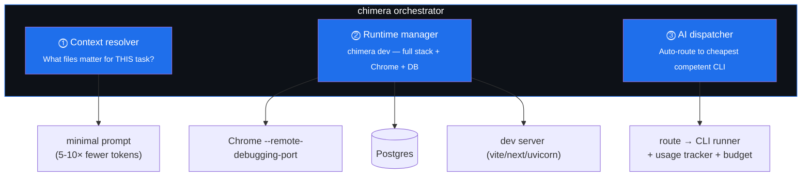
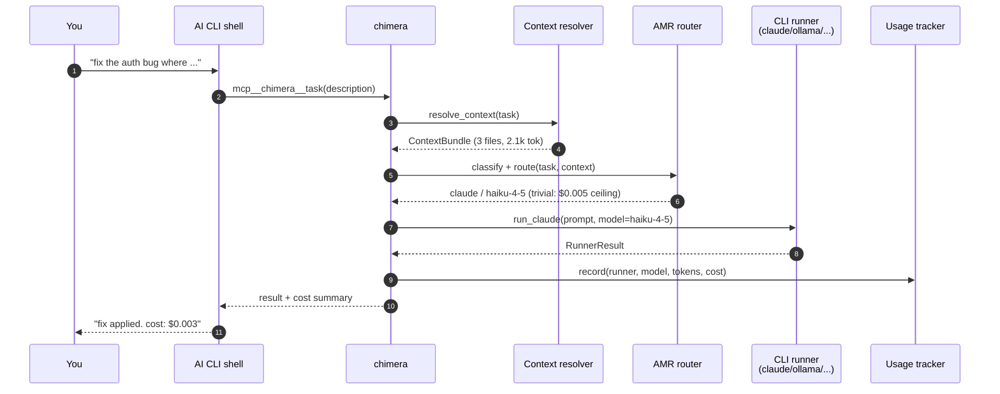
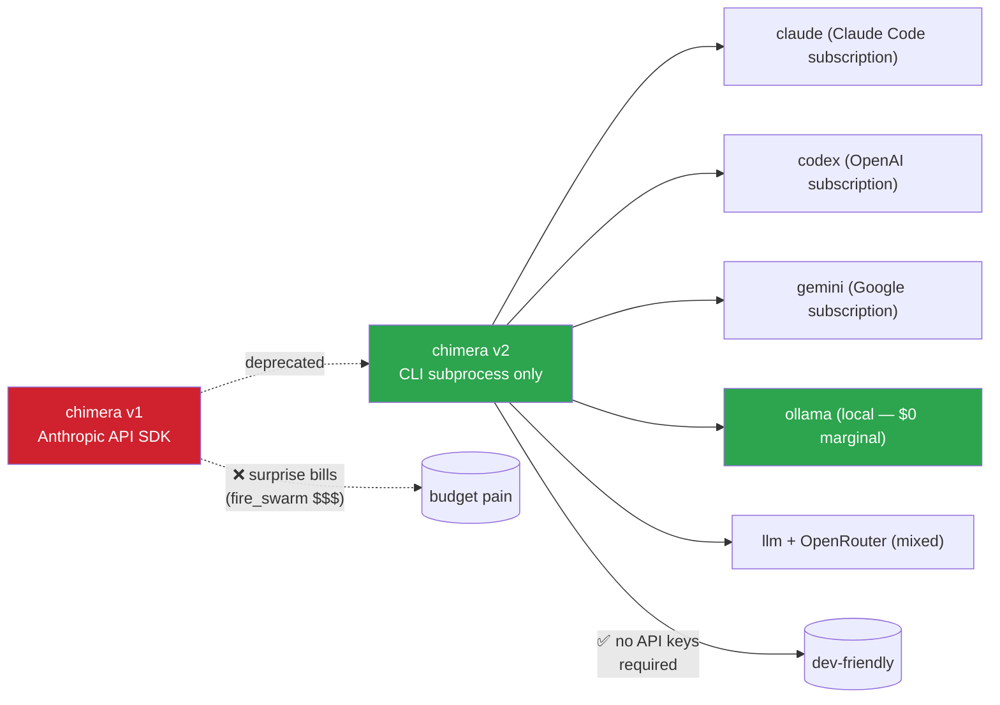
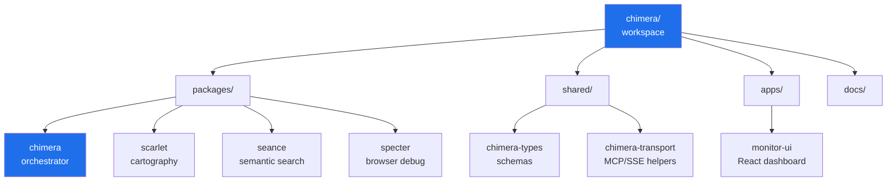
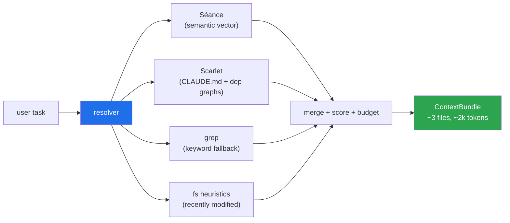
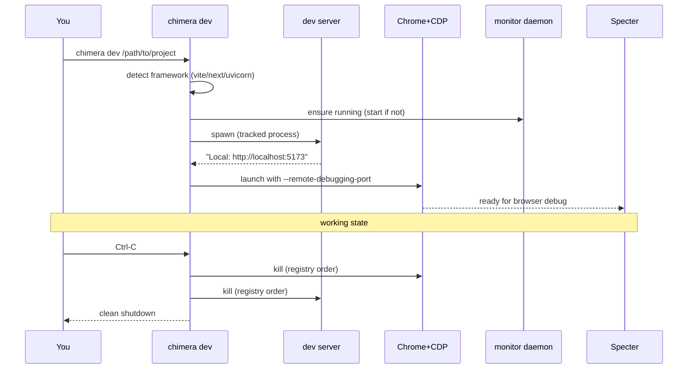
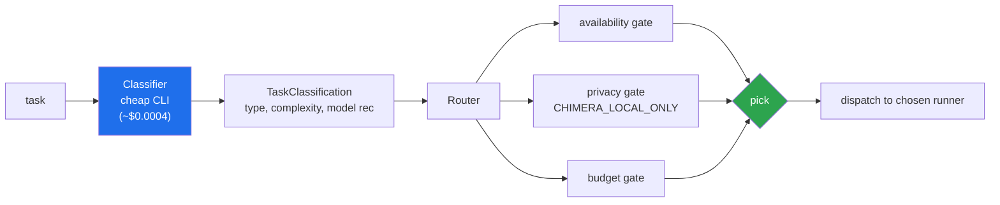
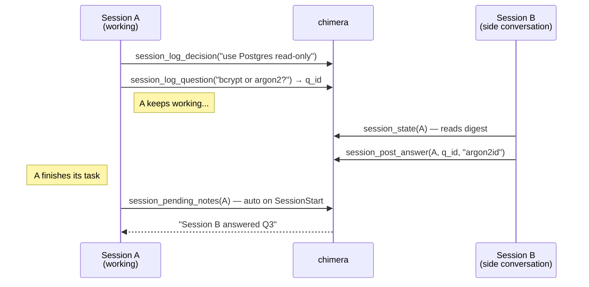
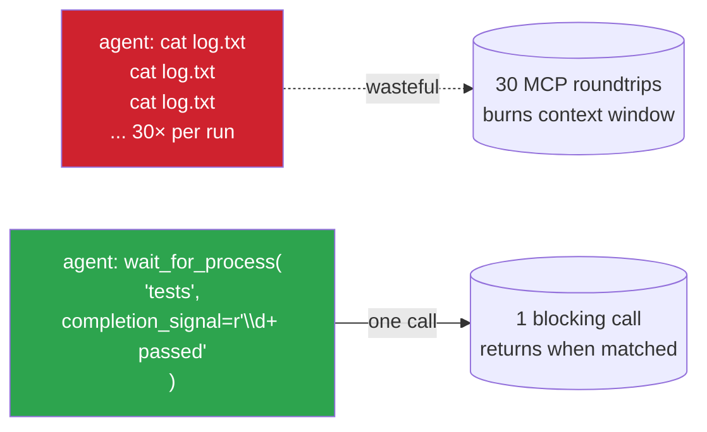

# chimera

> Multi-model AI orchestration for the terminal AI era.

chimera is a dev framework that makes your terminal AI tool — Claude Code, Codex CLI, Gemini CLI, or local Ollama — 5–10× more efficient. It pre-resolves task-relevant context, manages your dev stack with a debugger-attached browser, and routes every prompt to the cheapest competent model. **No API keys required to start; bring your own when you want premium models.**

---

## How it fits into your workflow


You drive your AI shell as usual. Chimera is the layer that picks the right tool for each task and shrinks the prompt before it goes out.

---

## Three pillars



1. **Context resolver** — Séance (semantic search) + Scarlet (codebase cartography) + grep + filesystem heuristics. Answers *"what files actually matter?"* before anything hits the LLM. Where the 5-10× token reduction lives.
2. **Runtime manager** — `chimera dev` starts your dev server, launches Chrome with `--remote-debugging-port` for Specter, ensures chimera-monitor is up. One Ctrl-C tears it all down.
3. **AI dispatcher** — auto-router (AMR pattern) classifies each task and dispatches to the cheapest competent CLI runner: Claude Code, Codex, Gemini, Ollama, or `llm` (Simon Willison's, covers OpenRouter + 100+ providers).

---

## How a single task flows through chimera



Every dispatch is **classify → route → run → record**. The classifier is a small cheap call (~$0.0004); the savings from routing trivial tasks down-tier dwarf its cost.

---

## Why pure CLI substrate



**Pitch in one sentence:** *"chimera orchestrates your terminal AI tools without ever making an API call of its own. No keys, no surprise bills, no external SDK dependencies."*

---

## Repository layout



Each `packages/<name>/` has both:
- a **library API** (`<name>.api.*`) for in-process use by chimera
- an **MCP server** (`<name>.server.mcp`) for direct shell use

Same logic, two transports — like an SDK and a SQL interface to the same database engine.

---

## Quick start

```bash
# clone + install (uv handles the workspace)
git clone https://github.com/fsocietydisobey/chimera.git
cd chimera
uv sync --package chimera

# diagnose your environment
uv run chimera doctor

# auto-routed dispatch (dry-run first to see what it'd do)
uv run chimera task --dry-run "rename this variable"

# start the observability daemon
uv run chimera monitor start
# → http://127.0.0.1:8740 (loopback only — that IS the auth layer)

# spin up a project's full dev stack with one command
uv run chimera dev /path/to/project
```

To use chimera as an MCP server from Claude Code / Codex CLI / Gemini CLI:

```jsonc
// in .claude.json or equivalent
{
  "mcpServers": {
    "chimera": {
      "type": "stdio",
      "command": "bash",
      "args": ["-lc", "uv --directory /path/to/chimera run chimera mcp"]
    }
  }
}
```

42+ MCP tools available: orchestration, monitor, process observability, multi-session shared state.

---

## Pillars in detail

### Pillar 1 — Context resolver

Pre-LLM "what's relevant?" — minimizes prompt before anything bills.



When Séance/Scarlet aren't installed, the resolver falls back to grep + fs heuristics. **Quality scales with what's available; the interface doesn't change.**

### Pillar 2 — Runtime manager

`chimera dev` is the demoable wow-moment.



Without `chimera dev`, the same setup is 4-5 manual commands and orphaned processes when something crashes.

### Pillar 3 — AI dispatcher (AMR — automatic model router)



The router picks among installed runners using a YAML routing table that ships with sensible defaults (overridable per-user / per-project).

---

## Multi-session shared state

When one Claude Code session is grinding on a task, you can't ask related questions in another window without losing context. Chimera externalizes session state so parallel sessions can collaborate.



The bidirectional inbox closes the loop — without write-back, the design collapses to "B reads A, human relays."

---

## Process observability — replace polling with one blocking call



The chimera daemon tails the process internally; the agent makes one blocking MCP call. Single roundtrip replaces dozens of polls.

---

## Status & roadmap

See [`tasks/BUILD-PLAN.md`](tasks/BUILD-PLAN.md) for full status. Cliff-notes:

| Phase | Status |
|---|---|
| 0 — Monorepo scaffold | ✅ |
| 1 — Shared types | ✅ |
| 2 — CLI runners (pure-CLI substrate) | ✅ |
| 3 — AMR (auto model router) | ✅ |
| 4 — Context resolver (with grep/fs fallbacks) | ✅ |
| 5 — `chimera dev` runtime manager | ✅ |
| 6 — `chimera task/route/doctor/monitor/mcp/dev` CLI | ✅ |
| 7 — Monitor daemon migration | ✅ |
| 8 — All 8 LangGraph patterns migrated | ✅ |
| 9 — Frontend (`apps/monitor-ui`) | ✅ |
| 11 — Multi-session shared state | ✅ (backend) |
| 12 — Process observability | ✅ (backend) |
| 4½ — Séance/Scarlet library APIs | ⬜ |
| 10 — API removal (deprecate langchain_anthropic) | ⬜ |
| Hooks for Phase 11 (PostToolUse, SessionStart) | ⬜ |
| Burn-down savings dashboard widget | ⬜ |

---

## Status

Pre-alpha. Active development. Legacy version archived at [`fsocietydisobey/chimera-legacy`](https://github.com/fsocietydisobey/chimera-legacy) for historical reference.
