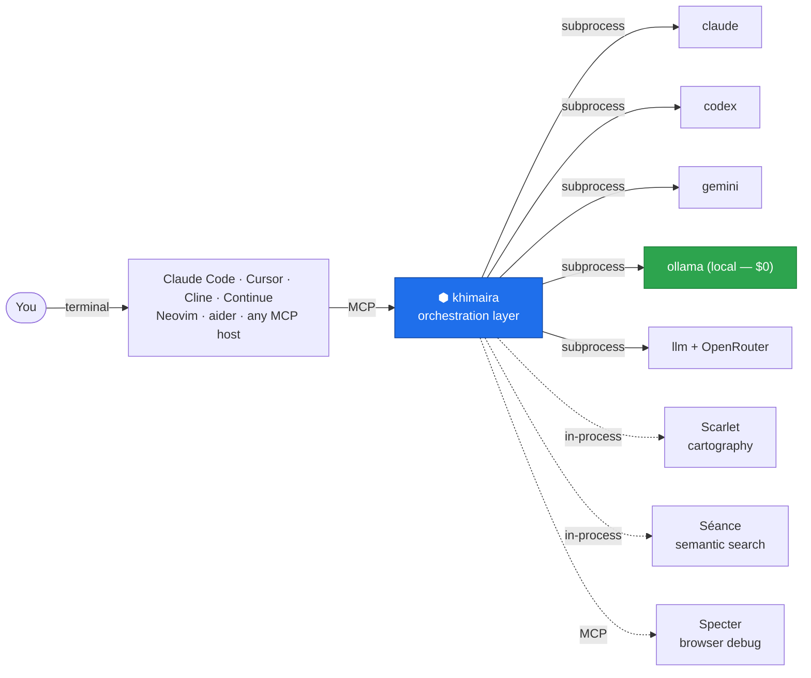
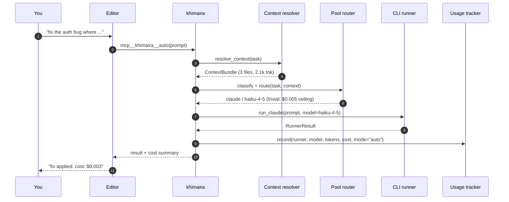
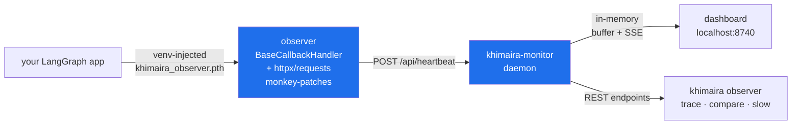
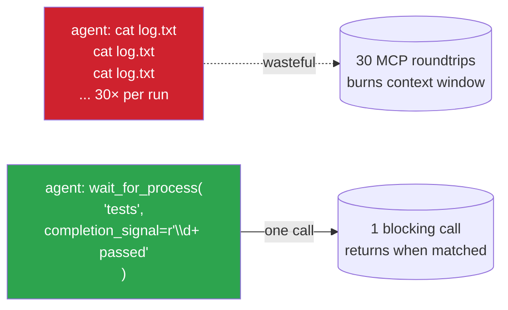
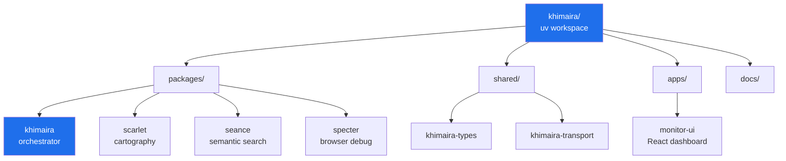

# khimaira

> The orchestration layer that lives below any AI tool. One MCP config
> line connects your editor — Claude Code, Cursor, Cline, Continue,
> Neovim, aider — to a single khimaira server that routes every
> prompt to the cheapest competent model, observes any LangGraph app,
> coordinates parallel sessions, and tracks real savings against your
> always-Opus baseline.

**No API keys required to start. No editor plugin to install. No new
UI to learn.**

---

## Real savings, real numbers

khimaira logs every dispatch and computes the counterfactual: *what
would this have cost if everything had run on Opus?* The delta is
your savings — auditable, per-run, never estimated.

```bash
khimaira usage savings
```

```
Window: last 30 days  (243 records)
  auto-mode records:     187
  subagent records:      31
  baseline model:        claude-opus-4-7

Total actual spend:                  $  3.4210
If everything had been baseline:     $ 47.8920
  → savings (auto + subagent):       $ 38.7531
  → routing efficiency:                  87.4%  (vs claude-opus-4-7)
```

Two routes earn savings credit:

- **`mode=auto`** — an agent or human called
  `mcp__khimaira__auto(prompt)`. The classifier (~$0.0004) picks a
  task tier; the pool router picks the cheapest model in that tier
  from the enabled pool. Audit log in `~/.local/state/khimaira/khimaira.log`
  shows pool size, top-2 candidates, and rejected reasons per dispatch.
- **`mode=subagent`** — Claude Code's auto-delegation routed the
  prompt to one of the `khimaira-*` subagents in `~/.claude/agents/`.
  Native model-swap; recorded by the `SubagentStop` hook. A single
  `khimaira-factual` dispatch on Haiku shows ~94.7% savings vs Opus.

Override the baseline (e.g. compare against Sonnet) via
`KHIMAIRA_USAGE_BASELINE_MODEL=claude-sonnet-4-6` or `baseline_model:`
in `~/.khimaira/models.yaml`.

---

## Install — one MCP config line

```jsonc
{
  "mcpServers": {
    "khimaira": {
      "command": "uvx",
      "args": ["khimaira", "mcp"]
    }
  }
}
```

Drop that into any MCP host's config (Claude Code, Cursor, Cline,
Continue, custom). Restart the editor. khimaira self-configures on
first connect — registers hooks, installs the supervisor, builds the
dashboard.

For shell-driven installs (or pinned profiles across many machines):

```bash
uvx --from git+https://github.com/fsocietydisobey/khimaira khimaira bootstrap \
    --profile https://raw.githubusercontent.com/fsocietydisobey/khimaira/main/khimaira-profile.community.yaml
```

Full guide: [`docs/INSTALL.md`](docs/INSTALL.md). Adapter authors
integrating khimaira with a different editor: [`docs/PROTOCOL.md`](docs/PROTOCOL.md).

---

## Where khimaira sits



Khimaira does NOT replace your editor, ship a TUI, or introduce a
chat UI. It runs below the model-selection layer. Removing it leaves
your editor working exactly as before.

**Pure CLI substrate** — khimaira invokes your terminal AI tools as
subprocesses; it never makes API calls of its own. No keys, no
surprise bills, no provider SDK lock-in. Local-only via Ollama is a
zero-marginal-cost backstop.

---

## How a task flows through khimaira



Every dispatch is **classify → route → run → record**. The classifier
cost is dwarfed by the savings from routing trivial tasks down-tier.

---

## What you get

| Capability | One-liner |
|---|---|
| **Auto-routing** | `mcp__khimaira__auto(prompt)` picks the cheapest competent model from your pool. Real savings tracked. |
| **Subagent library** | 8 curated Claude Code subagents at `~/.claude/agents/khimaira-*`, each pinned to the right model. Native auto-delegation; you don't think about it. |
| **LangGraph observer** | `khimaira attach <app>` injects a zero-touch observer into any Python project's venv. Cost, slow calls, trace waterfalls in a local dashboard. |
| **Multi-session coordination** | Sessions, inboxes, handoffs, decisions, transcripts. Parallel Claude/Cursor/Cline windows can ask each other questions, leave directives, see what stopped sessions said. |
| **Process observability** | `wait_for_process(label, completion_signal=regex)` replaces 30 polling calls with one blocking MCP call. |
| **Codebase cartography** | Séance (semantic vector search), Scarlet (CLAUDE.md + dep graphs), Specter (browser debug via CDP) — all under one MCP roof. |
| **Task sources** | SessionStart hook surfaces what's on your plate from any configured task source (JSONL, GitHub Issues, plug in your own via Protocol). |

Full surface map: `khimaira tools`.

---

## The model registry — `~/.khimaira/models.yaml`

Which models are enabled for `auto`'s pool, at what cost-per-million,
with what capabilities. User-editable YAML. Sensible defaults ship;
override per-machine without forking khimaira.

```yaml
baseline_model: claude-opus-4-7   # for savings counterfactual

models:
  - id: claude-haiku-4-5
    runner: claude
    input_per_m: 0.8
    output_per_m: 4.0
    enabled_for_auto: true
    capabilities: [factual, syntax, simple-code, classification]

  - id: gemini-2.5-flash
    runner: gemini
    input_per_m: 0.075
    output_per_m: 0.30
    enabled_for_auto: true
    capabilities: [factual, syntax, simple-code, large-context]

  - id: claude-sonnet-4-6
    runner: claude
    input_per_m: 3.0
    output_per_m: 15.0
    enabled_for_auto: true
    capabilities: [multi-file-reasoning, code-review, refactor]
```

`khimaira models sync` diffs your registry against shipped defaults
and applies merges (with backup) when you want to pick up new models.

---

## Subagent library — thinking-token interception

8 curated Claude Code subagents at `~/.claude/agents/khimaira-*.md`,
each pinned to the right model for its role. When Claude Code's
auto-delegation matches a subagent's `description`, it routes the
work there and **swaps the model for that turn**. Opus delegates
trivial work to Haiku without you (or the parent agent) doing
anything.

| Agent | Model | Routes when… |
|---|---|---|
| `khimaira-factual` | haiku | definitional + syntax-lookup questions, no codebase reads |
| `khimaira-code-fast` | haiku | mechanical edits (renames, formatting, one-line fixes) |
| `khimaira-grep` | haiku | exact-symbol search, file pattern, known string lookup |
| `khimaira-research` | sonnet | multi-file tracing, cross-file context for refactors |
| `khimaira-code-deep` | sonnet | non-trivial code changes requiring judgment |
| `khimaira-debug` | sonnet | first-pass debugging when symptom + repro available |
| `khimaira-architect` | opus | non-trivial design decisions, module boundaries, trade-offs |
| `khimaira-deep-debug` | opus | hypothesis-driven escalation when cheaper attempts got stuck |

Shipped via the bootstrap framework — `khimaira bootstrap` (or
`khimaira sync`) symlinks `~/.claude/agents/` into your dotfiles. The
`SubagentStop` hook records each dispatch to `usage.jsonl` so
`khimaira usage savings` credits the routing.

---

## LangGraph observability

`khimaira attach <app-path>` injects a zero-touch observer into any
Python project's venv. No source changes, no env vars, no installed
deps in the app's manifest. Restart the app — every LangGraph node,
every LLM call, every external HTTP request streams to
khimaira-monitor in real time.



| Surface | What it shows |
|---|---|
| `/{project}` | Live LangGraph topology + node-by-node execution + replay |
| `/{project}/cost` | Estimated USD spend by model, token counts, telemetry-overhead callout |
| `/{project}/trace/{cid}` | Waterfall view of one run — chain / llm / tool / external bars on a time axis (proves `asyncio.gather` is actually concurrent) |
| `khimaira observer trace <p> <cid>` | Full event timeline as text |
| `khimaira observer compare <p> <cid-a> <cid-b>` | A/B per-node wall-time deltas with regression markers |
| `khimaira observer slow <p> --llm 5 --external 30` | Recent calls past threshold + in-flight stuck detection |

### Auto-correlation (zero app code changes)

Every event the observer emits is auto-tagged with the LangGraph
run's top-level `correlation_id`. The observer reads LangChain's
`parent_run_id=None` signal on `on_chain_start`, sets a `ContextVar`,
and propagates it through async + thread boundaries to every
downstream event — including HTTP monkey-patch interceptors. Your
app code: unchanged.

```python
result = graph.invoke(state)
# Now queryable: GET /api/heartbeats/<project>/by-correlation/<run_id>
# returns every chain/llm/tool/external event for this run
```

Override with `khimaira_observer.tag_run(my_id)` only when you want a
domain-specific identifier (deliverable id, business txn id) instead
of the auto UUID.

---

## Multi-session coordination

When one Claude Code session is grinding on a task, you can't ask
related questions in another window without losing context. Khimaira
externalizes session state so parallel sessions can collaborate — and
future sessions can pick up where stopped ones left off.

| Goal | Tool |
|---|---|
| Ask an active session, need answer this turn | `session_log_question(target_session_id=B)` + `session_wait_for_answer(qid)` |
| FYI / ack to another session, no reply | `session_post_notice(target_session_id=B, text=...)` |
| Leave a directive for whoever opens this project next | `session_post_handoff(text=..., scope_cwd=...)` |
| Read what a stopped session discussed about topic X | `session_query_transcript(session_id, query="X")` |
| Heuristic digest of a stopped session, no LLM cost | `session_summarize_transcript(session_id)` |
| Search past inbox notes (drained / acked / auto-expired) | `session_search_archive(session_id, query)` |
| Delegate a slice of a handoff to a named session | `session_invite_handoff(parent_id, owner, invitee, text)` |

Two hooks ship with khimaira and install via `khimaira install-hooks`:

- **SessionStart** — auto-reads inbox + matched handoffs + lists
  other active sessions + open task assignments
- **UserPromptSubmit** — auto-fetches new inbox notes + incoming
  questions targeting this session, injects both every turn

You never manually poll; the loop is closed structurally. See
[`docs/INBOX-AND-HANDOFFS.md`](docs/INBOX-AND-HANDOFFS.md) for the
mental model and intent → primitive map.

### Example — real-time cross-session ask

```python
# Session A, mid-turn:
qid = session_log_question(
    session_id=ME,
    text="Roboflow per-page parallelization look right?",
    target_session_id="llm-piping-extension",
)
answer = session_wait_for_answer(ME, qid, timeout=300)
# → A blocks. B's UserPromptSubmit hook surfaces the question on B's
#   next turn. B answers via session_post_answer. A unblocks instantly
#   and continues processing in the SAME turn.
```

User effort: one prompt to A, one prompt to B. No copy-paste relay.

### Example — handoff to a future session

```python
session_post_handoff(
    from_session_id=ME,
    text="HANDOFF: shipped Phase 1.5 MVP. Pickup tasks/task-sources/IMPLEMENTATION.md "
         "for the Linear adapter follow-up. 240/240 tests passing.",
    scope_cwd="/home/_3ntropy/dev/khimaira",
    expires_in_hours=168,
)
```

Three days later, whoever boots in that cwd gets the directive
surfaced in their SessionStart context. They own it; the prior
session has moved on.

---

## Process observability



The khimaira daemon tails the process internally; the agent makes
one blocking MCP call. Single roundtrip replaces dozens of polls.

---

## Day-to-day commands

```bash
khimaira doctor                 # diagnose: daemon? supervisor? hooks current?
khimaira usage savings          # 30-day savings vs Opus baseline
khimaira route "rename X to Y"  # classify-only — see what would happen
khimaira task "rename X to Y"   # classify + dispatch
khimaira monitor start          # observability daemon (or use supervisor)
khimaira dev /path/to/project   # full dev stack: server + Chrome + monitor
khimaira tools                  # everything khimaira exposes
```

---

## Repository layout



Each `packages/<name>/` exposes both a library API for in-process use
by khimaira and an MCP surface. Same logic, two transports — like an
SDK and a SQL interface to the same engine.

---

## Status & roadmap

Strategic source-of-truth: [`NORTH_STAR.md`](NORTH_STAR.md). Adapter
contract: [`docs/PROTOCOL.md`](docs/PROTOCOL.md). Live phase status:

| Phase | Status |
|---|---|
| Routing engine (classifier, pool router, registry) | ✅ |
| MCP surface (~61 tools across orchestration, sessions, observer, processes) | ✅ |
| Usage tracking + counterfactual savings command | ✅ |
| Auto-mode (`mcp__khimaira__auto` + budget gate + multi-turn) | ✅ |
| Subagent library — Phase 1.2 (8 agents, SubagentStop hook → usage.jsonl) | ✅ |
| LangGraph observer (zero-touch, auto-correlation, trace waterfall) | ✅ |
| Cost dashboard + slow-call alerts + circuit breakers + rate-limit handling | ✅ |
| Multi-session shared state + cross-session primitives + transcript query | ✅ |
| Process observability (`wait_for_process` regex completion signal) | ✅ |
| Bootstrap framework + profile-driven cross-machine install | ✅ |
| Phase 1.1 — Protocol docs (`docs/PROTOCOL.md`) | ✅ |
| Phase 1.5 — Task-source Protocol + JSONL/GitHub reference adapters | ✅ MVP |
| Phase 1.0 — MCP-first self-configuration (`setup_*` MCP tools) | ⬜ next |
| Phase 1.3 — PreToolUse interceptor v1 (passive delegation suggester) | ⬜ |
| Phase 2 — Cross-editor adapter configs in `contrib/` (Cursor, Neovim, Cline, aider) | ⬜ |
| Phase 3 — OSS distribution (PyPI publish, README rewrite ← this doc, demo assets) | 🚧 |
| Linear / Jira / Asana adapters (Phase 1.5 community follow-ups) | ⬜ |

Open operational debt + known gaps tracked in `NORTH_STAR.md`.

---

## More docs

- [`docs/INSTALL.md`](docs/INSTALL.md) — three install paths
- [`docs/PROTOCOL.md`](docs/PROTOCOL.md) — adapter integration contract (HTTP / MCP / CLI)
- [`docs/INBOX-AND-HANDOFFS.md`](docs/INBOX-AND-HANDOFFS.md) — cross-session coordination mental model
- [`docs/ARCHITECTURE.md`](docs/ARCHITECTURE.md) — internal architecture
- [`NORTH_STAR.md`](NORTH_STAR.md) — strategic roadmap + principles + anti-goals
- [`CLAUDE.md`](CLAUDE.md) — engineering rules captured from real bugs in this codebase

---

## Status

Pre-alpha. Active development. Legacy version archived at
[`fsocietydisobey/khimaira-legacy`](https://github.com/fsocietydisobey/khimaira-legacy).
