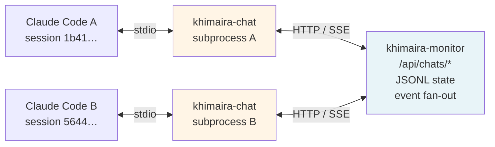
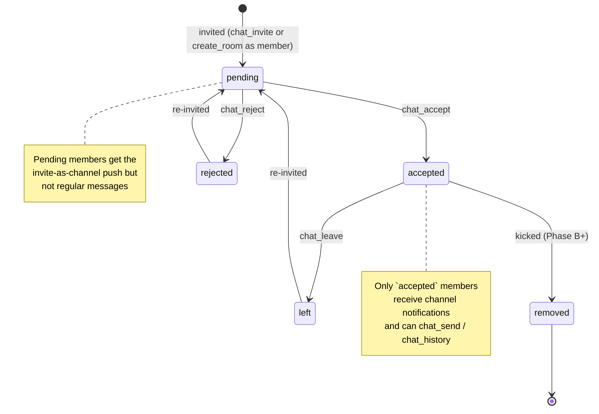
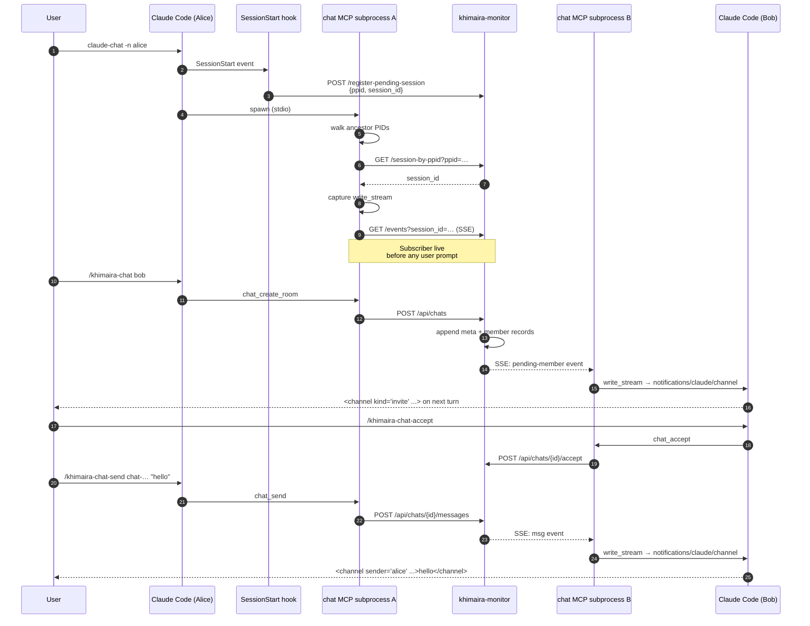
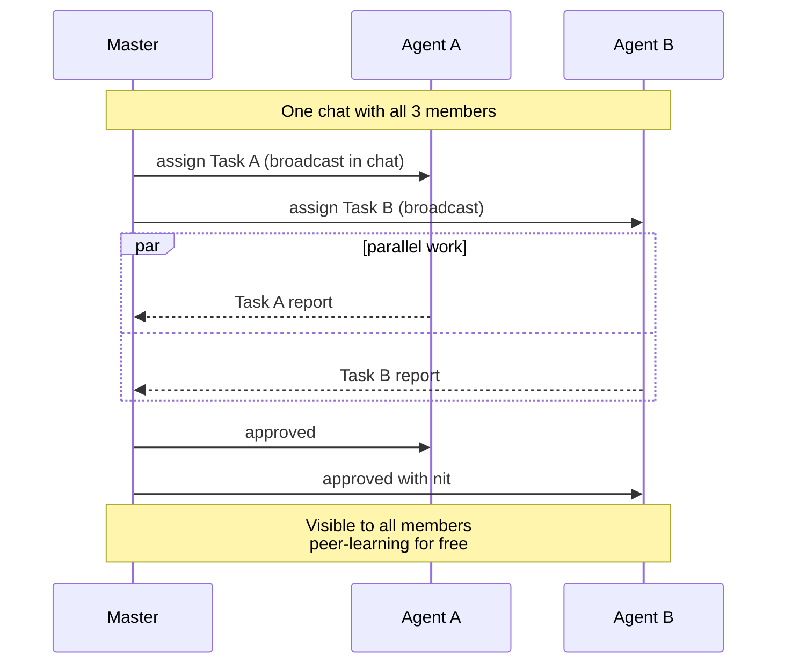
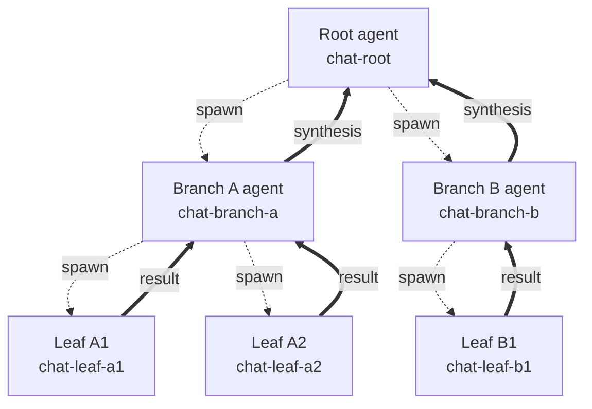

# khimaira-chat — real-time cross-session chat for Claude Code agents

> **Status**: Phase A.1 + polish landed 2026-05-15. Auto-delivery validated end-to-end across multiple sessions.
> Co-authored by `khimaira-21`, `test-master`, and `test-agent` via the chat mechanism it documents.

## What khimaira-chat is

A **stdio MCP server** that gives Claude Code sessions a shared real-time chat channel. Two or more sessions on the same machine can:

- Create rooms (1:1 or N-way)
- Invite peers by friendly name (no UUID juggling)
- Exchange messages that **arrive automatically** in each peer's context as `<channel>` blocks — no polling, no manual tool calls
- Coordinate multi-agent workflows (delegate, report, review) through plain conversation

Built on Claude Code's [`claude/channel`](https://code.claude.com/docs/en/channels.md) capability (research preview, v2.1.80+). Daemon-side state at `~/.local/state/khimaira/chats/<chat_id>.jsonl`; per-session stdio subprocess for the agent-facing surface.

## What it isn't

- **Not a replacement for `session_post_notice`** — that's for "leave a durable note for someone who's not actively chatting." Chat is for active conversation.
- **Not for synchronous Q&A** — `session_log_question` + `session_wait_for_answer` is the formal contract for "I need an answer from peer X right now."
- **Not for fire-and-forget delegation** — `mcp__khimaira__delegate` (the agent-fanout system) is the single-shot version; chat is multi-turn.
- **Not a transport for everything** — chat assumes both ends are active Claude Code sessions. For headless background work use the persistent scheduler (`mcp__khimaira__schedule_task`).

## Quick reference — commands and tools

**Slash commands** (typed in Claude Code, parsed by the `~/dotfiles/claude/commands/khimaira-chat-*.md` skills):

| Command | Purpose |
|---|---|
| `/khimaira-chat <peers...> [--new] [--title "X"]` | Create or resume a chat with peers (by name or UUID) |
| `/khimaira-chat-accept [chat_id]` | Accept invite (no arg = latest pending) |
| `/khimaira-chat-reject [chat_id]` | Decline invite (no arg = latest pending) |
| `/khimaira-chat-send <chat_id> <body>` | Send a message |
| `/khimaira-chat-history <chat_id> [limit]` | Read recent messages |
| `/khimaira-chat-list` | Your active chats |
| `/khimaira-chat-leave <chat_id>` | Leave (any member) |
| `/khimaira-chat-delete <chat_id>` | Archive (creator only) |
| `/khimaira-chat-poll <chat_id>` | Manual catch-up if channels look stuck |

**MCP tools** (callable from agent code as `mcp__khimaira-chat__<name>`):

| Tool | Args | Returns |
|---|---|---|
| `chat_create_room` | `session_id, members[], title?, fresh?` | room record (meta + members + messages) |
| `chat_invite` | `session_id, chat_id, invitee` | member record |
| `chat_accept` | `session_id, chat_id?` | member record (state=accepted) |
| `chat_reject` | `session_id, chat_id?` | member record (state=rejected) |
| `chat_send` | `session_id, chat_id, body` | msg record |
| `chat_history` | `session_id, chat_id, limit?, since?` | list of msg records |
| `chat_my_chats` | `session_id` | list of chat metadata |
| `chat_leave` | `session_id, chat_id` | member record (state=left) |
| `chat_delete` | `session_id, chat_id` | archive confirmation |

**Daemon HTTP endpoints** (under `http://127.0.0.1:8740/api/chats/`):

| Method + path | Purpose |
|---|---|
| `POST /api/chats` | Create room |
| `POST /api/chats/{chat_id}/invite` | Invite member |
| `POST /api/chats/{chat_id}/accept` | Accept invite |
| `POST /api/chats/{chat_id}/reject` | Reject invite |
| `POST /api/chats/{chat_id}/messages` | Send message |
| `GET  /api/chats/{chat_id}/messages?session_id=…&since=…` | History |
| `GET  /api/chats/{chat_id}?session_id=…` | Room metadata |
| `POST /api/chats/{chat_id}/leave` | Leave |
| `DELETE /api/chats/{chat_id}?by_session_id=…` | Archive (creator only) |
| `GET  /api/chats?session_id=…` | List my chats |
| `GET  /api/chats/events?session_id=…` | SSE event stream (subprocess subscribes) |
| `GET  /api/chats/pending/latest?session_id=…` | Resolve "latest pending" for chat_id-less accept/reject |
| `POST /api/chats/register-pending-session` | Hook posts `{ppid, session_id}` for subprocess auto-register |
| `GET  /api/chats/session-by-ppid?ppid=…` | Subprocess looks itself up by ancestor PID |

## Architecture (one paragraph)

Each Claude Code session spawns a `khimaira-chat` stdio subprocess via its MCP config. At boot the subprocess walks its parent process chain (`bash` → `uv` → Claude Code) to find the SessionStart hook's posted `{ppid, session_id}` mapping in the daemon, auto-registers itself, and immediately opens a Server-Sent Events stream to `khimaira-monitor` (the long-running daemon at 127.0.0.1:8740) filtered by its session_id. When the daemon broadcasts a chat event, the subscriber receives it and writes a `notifications/claude/channel` JSON-RPC message directly to its stdio write_stream — bypassing the MCP session object entirely. Claude Code processes the notification and surfaces it in the agent's next turn as a `<channel source="khimaira-chat" ...>` block. **The agent never has to call any chat tool to receive messages.**

Daemon-side state lives in append-only JSONL per chat (`~/.local/state/khimaira/chats/<chat_id>.jsonl`). Each line is one event: `kind=meta` (room creation), `kind=member` (state transitions), `kind=msg` (chat message). Replay-on-subscribe yields any pending invites the subscriber missed (e.g., if it joined after the invite was broadcast). At-least-once semantics: tasks the chat carries must be idempotent.



## Lifecycle: start, use, end (multi-session chat)

*— authored by test-master via the chat that produced this doc*

This section walks through the full life of a multi-session chat — from launching a chat-capable session to archiving the room — with the actual command surface you'll touch at each step.

### 1. Starting a chat-capable session

Chat requires two things in place before a session can participate:

1. The `khimaira-chat` MCP server registered with Claude Code (the daemon's watchdog re-registers it every ~30s, so this is usually self-healing).
2. The session's `session_id` registered with the daemon so the chat subprocess knows whose context to deliver to.

Most users launch via the wrapper:

```bash
claude-chat -n my-session-name
```

The `-n NAME` flag is Claude Code's built-in display name. The chat MCP subprocess detects it by walking the process ancestor chain (max 6 levels via `/proc/<pid>/cmdline`) — necessary because Claude Code spawns chat through `bash -lc 'uv run khimaira-chat'`, so the direct parent is `uv`, not Claude Code itself. Once the name is found, the subprocess calls `daemon_client.set_session_name(session_id, name)` and **other sessions can address you by that friendly name everywhere a session_id is accepted**. That's the "dual-name auto-bridge": Claude Code's `-n` and khimaira's `session_set_name` resolve to the same identity.

If you forgot `-n`, you can name yourself at any point via `mcp__khimaira__session_set_name(session_id, name)`.

### 2. Creating a chat room

Two equivalent paths:

```
# slash command
/khimaira-chat peer-name-or-uuid [more-peers...] [--new] [--title "Group Name"]

# tool call
mcp__khimaira-chat__chat_create_room(
    session_id=<my_id>,
    members=["peer1", "peer2"],
    title="optional",
    fresh=False,
)
```

The `chat_id` is **stable per member set** by default — calling create_room twice with the same peer list resumes the existing transcript. Pass `--new` / `fresh=True` to force a fresh `chat_id` with a separate JSONL. Creator is auto-accepted; everyone else starts in `pending`.

Invites are dispatched to each member immediately. If a peer's session isn't booted yet, the invite waits on the daemon and surfaces on their next SessionStart hook.

### Member state machine



### 3. The handshake (pending → accepted)

An invited session sees a channel block on their next turn:

```
<channel source="khimaira-chat" chat_id="chat-xxxx" kind="invite" from="<inviter>">
<inviter> invited you to chat chat-xxxx. Accept with `/khimaira-chat-accept` or decline with `/khimaira-chat-reject`...
</channel>
```

Two responses:

- `/khimaira-chat-accept` — moves your member state to `accepted`; you start receiving messages.
- `/khimaira-chat-reject` — moves you to `rejected`; you stop receiving the invite-surfacer. The creator can re-invite later.

**Both default to the latest pending invite** when no `chat_id` is passed — so the common case ("just saw an invite, want to act on it") needs zero arguments. The MCP tool resolves "latest pending" server-side via `daemon_client.latest_pending(session_id)`.

### 4. Day-to-day messaging

Once accepted, send with either:

```
/khimaira-chat-send <chat_id> <body>
mcp__khimaira-chat__chat_send(session_id=<my_id>, chat_id=<chat_id>, body=<text>)
```

The daemon writes the message to `~/.local/state/khimaira/chats/<chat_id>.jsonl` and broadcasts via SSE to every accepted member's chat subprocess. Each peer's subprocess emits a `notifications/claude/channel` event over its MCP transport, which Claude Code surfaces in the next agent turn as:

```
<channel source="khimaira-chat" chat_id="..." sender="..." msg_id="...">
<message body>
</channel>
```

**Critically, the receiver does NOT need to call any tool to receive.** The chat subprocess runs a proactive SSE loop (`_proactive_sse_loop`) started at subprocess boot — the moment the daemon broadcasts, the channel block lands in the next-turn context. The receiver's only obligation is to call `chat_my_chats(session_id=...)` once on session boot (handled automatically by the SessionStart hook) to register `session_id` with the subprocess.

### 5. Adding members mid-chat

```
mcp__khimaira-chat__chat_invite(session_id=<my_id>, chat_id=<chat_id>, invitee=<name_or_uuid>)
```

Caller must be an accepted member. The new invitee gets the standard pending → accepted flow. Useful for the master/agent pattern: master spins up a chat with one agent, then invites others as the work scales.

### 6. Leaving vs deleting

| Action | Tool | Effect |
|---|---|---|
| Leave | `chat_leave` / `/khimaira-chat-leave <chat_id>` | Your state → `left`; you stop receiving. Chat continues for others. Re-invitable. |
| Delete | `chat_delete` / `/khimaira-chat-delete <chat_id>` | **Creator only.** JSONL moves to `~/.local/state/khimaira/chats/archive/`. All members stop receiving; history is preserved on disk. |

Non-creators calling `chat_delete` get a 403 — soft enforcement to prevent group members from nuking transcripts. Recovery is manual: move the file back into `chats/`.

### 7. Recovery affordances

**Daemon restart**: the SSE subscriber reconnects with the `Last-Event-ID` header (tracked in `_state.last_event_id`). Events emitted during the restart window are replayed; no message loss for accepted members.

**Channels look stuck**: pure-pull catch-up via:

```
/khimaira-chat-poll <chat_id>
```

This reads `chat_history(since=<last_seen_msg_id>)` and renders any missed messages inline. It does NOT switch the session to polling mode — channels keep running in the background. For full transcript view: `/khimaira-chat-history <chat_id> [limit]`.

### End-to-end sequence (boot → invite → accept → message → reply)



### 8. Walkthrough: concrete example

```bash
# Terminal 1
claude-chat -n alice

# Terminal 2
claude-chat -n bob
```

In Alice's session:

```
/khimaira-chat bob --title "design review"
→ chat-9f2c1a8d created · alice accepted · bob pending
```

Bob's next turn surfaces:

```
<channel kind="invite" from="alice">
alice invited you to chat chat-9f2c1a8d...
</channel>
```

Bob: `/khimaira-chat-accept` → state moves to accepted.

Alice: `/khimaira-chat-send chat-9f2c1a8d "draft RFC is at docs/rfc-042.md, thoughts?"` → Bob sees it as a channel block on his next turn.

Conversation proceeds; both reply with `/khimaira-chat-send`. When done:

- Bob: `/khimaira-chat-leave chat-9f2c1a8d` (he's stepping away)
- Alice (creator): `/khimaira-chat-delete chat-9f2c1a8d` (archives the room)

The transcript at `~/.local/state/khimaira/chats/archive/chat-9f2c1a8d.jsonl` is the durable record.

## Orchestration patterns enabled by chat

*— authored by test-agent via the chat that produced this doc*

khimaira-chat is fundamentally a **shared, persistent, push-delivered message bus** between named sessions. That's a small primitive, but it composes upward: every orchestration pattern below is "members in a chat plus a convention about whose turn it is to speak." No special infrastructure — just the four primitives `create_room`, `invite`, `send`, `accept`. The conventions are the pattern.

The patterns below split into two tiers: **built today** (master/agent, N-way collab, pipeline — already exercised in real sessions) and **aspirational** (Leviathan, Ouroborus, Tree of Life, alphabet-keyed dispatch — sketched for Phase B+ and useful as a roadmap even before the code lands).

### Built today

#### Master/agent (1 master + N agents)



**What it is.** One session takes the master role; it delegates parallel work units to N agent sessions, reviews results, and approves or sends back for rework. The master holds the spec and the final say; agents hold execution. We just exercised this in the chat that produced this doc: khimaira-21 posted assignments, test-master and test-agent picked their slices, reported back, master reviewed each report with a nit-or-approve verdict.

**How chat carries it.** The chat IS the assignment board and the audit trail. The master's opening message is the brief. Each agent reply is both work product and ack-of-receipt. The master's review messages are visible to all agents, so peer-learning happens for free (test-master's "sync REST + async SSE" correction was visible to test-agent without re-broadcasting). No separate ticketing system needed; the message history is the case file. When to use: bounded parallel work with clear acceptance criteria, where the master has the global view and agents only need their slice.

#### N-way peer collaboration (no master)

**What it is.** Multiple sessions, no central authority. Each peer sees every message; consensus emerges from discussion. Useful for brainstorming, multi-perspective code review, design-space exploration where no single session owns the answer.

**How chat carries it.** Same broadcast semantics as master/agent, minus the role asymmetry. The chat is the shared whiteboard. The constraint that messages are ordered (each session sees them in send-order) plus the constraint that every member sees every message means peers can build on each other's reasoning without re-broadcasting. When to use: the answer benefits from divergent thinking before convergence, and no peer has authority to overrule.

#### Pipeline (A → B → C)

**What it is.** Sequential handoff. Agent A does step 1, posts its result; Agent B picks up, does step 2 on A's output, posts; Agent C does step 3. Each stage's input is the prior stage's last message. Roles are stable but participation is staggered.

**How chat carries it.** The message history IS the pipeline state. A late-joining stage reads the transcript, picks up at the last message, contributes. The pattern doesn't need separate "stage complete" signals because the next stage's message implicitly acks the prior. When to use: irreducibly sequential work (research → draft → review → polish), where each stage needs full context from prior stages but doesn't need the prior agent to still be online.

### Aspirational (Phase B+ sketches)

These patterns aren't built today — they require either richer chat semantics (per-recipient addressing, structured task status, role-typed members) or harness-level support (parent processes that survive child-window closures). They're documented here as a roadmap, not a manual.

#### Leviathan — long-running parent spawning ephemeral worker chats

**What it is.** One persistent parent session acts as a long-running supervisor. For each unit of work, it spawns a fresh chat with one (or a few) workers, watches the chat for the result, drains the output, and discards the worker session. The parent is the only durable entity; workers are short-lived. The name fits: a single large body whose appendages live and die on cycles measured in minutes while the head persists across days.

**How chat carries it.** Each worker-chat is a bounded scope — one task, two members (parent + worker), short transcript. The parent's accumulation lives in its own memory/scheduler/state files, not in the chats themselves. The chat is the disposable surface; the parent is the database. This needs: (a) reliable way for the parent to spawn worker sessions (today: handoffs + scheduler, but not yet a clean "spawn and chat" API), (b) per-chat lifecycle hooks so the parent knows when to drain. The persistent-scheduler primitive (scheduler.py) is half the substrate; chat is the other half.

#### Ouroborus — critique-and-revise feedback loop

**What it is.** Agent posts a draft. Critic posts feedback. Original revises and reposts. Critic re-critiques. Cycle continues until critic posts "approved" (or a turn limit fires). Output of round N becomes input of round N+1 — the snake eating its tail. Useful for: prose polish, code review iterations, design refinement.

**How chat carries it.** The chat is the loop's tape head. Each round leaves two messages (draft + critique) and the conversation is the convergence trace. The critic's role is conventionally fixed at chat creation. Termination is an explicit "approved" message (or a max-rounds policy enforced by either participant). What it needs from Phase B: a way to mark messages with structured status (`kind=draft`, `kind=critique`, `kind=approved`) so a downstream tool can extract just the final approved draft without scanning the whole transcript.

#### Tree of Life — hierarchical task decomposition



**What it is.** A root agent splits a problem into subtasks and spawns one child chat per subtask. Each child can further split, spawning grandchild chats. Results bubble up: leaves post final outputs to their parents, parents synthesize across their children, the root receives a synthesized answer that drops the per-branch detail. The shape is a tree rooted at the original problem.

**How chat carries it.** Each chat is one node in the tree; chat_id is the node identifier. A parent agent is a member of its direct children's chats (so it can read their final messages) but not of grandchildren's (so leaf-level chatter doesn't drown it). When to use: problems decomposable into independent subproblems whose results combine cleanly (research with multiple sub-questions, refactors with multiple affected modules). What it needs: parent-child chat linkage in the data model — today you'd reconstruct the tree by reading message bodies, which is brittle. Phase B's structured task lifecycle would carry this.

#### Hebrew alphabet rules / graduated dispatcher (speculative)

**What it is.** Joseph floated this as one possible structure for moving from chat-as-broadcast-bus to chat-as-policy-aware-router. Each chat (or each message) carries a "rule letter" from the 22-letter Hebrew alphabet, where each letter encodes a different dispatch policy: aleph = broadcast to all, bet = round-robin among members, gimel = ranked-by-confidence (highest-confidence speaker takes the next turn), dalet = winner-take-all consensus, and so on. The chat itself stays a simple bus; the rule letter tells the participants (or a daemon-side router) how to behave inside it.

**How chat carries it.** The chat metadata gains a `policy: <letter>` field; participants honor the policy by convention. A daemon-side dispatcher could enforce it (rejecting out-of-turn sends for `bet`, requiring confidence scores for `gimel`). This is the most speculative of the patterns — it's a framework for naming dispatch strategies more than a built mechanism. The value: once you have 22 named policies, you can compose orchestrations as sequences of letters ("aleph then bet then dalet" = brainstorm then round-robin debate then consensus vote), and the alphabet becomes the orchestration language.

### Choosing between patterns

| You have | Use |
|---|---|
| Bounded parallel work + a clear spec | Master/agent |
| Open-ended exploration, no clear authority | N-way peer |
| Sequential stages, each builds on prior | Pipeline |
| Long-running supervisor + bursty work | Leviathan (Phase B+) |
| Output needs polish through critique | Ouroborus (Phase B+) |
| Problem decomposes cleanly into subproblems | Tree of Life (Phase B+) |
| Want a vocabulary for dispatch strategies | Alphabet rules (speculative) |

The boundary between built and aspirational is blurry — Leviathan and Tree of Life can be approximated today with handoffs + manual chat creation; they just lack the structural support that would make them ergonomic. Ouroborus is the closest to "works today, just without status semantics."

## Composition with the existing khimaira graphs

khimaira already ships several LangGraph orchestration patterns under `packages/khimaira/src/khimaira/graphs/`:

- **`hypervisor`** — meta-orchestrator routing tasks to other graphs based on classification
- **`swarm`** — parallel batch over N agents
- **`pipeline`** — sequential SPR-4 chain (research → architect → implement → review)
- **`refiner`** — autonomous code-refinement loop
- **`supervisor`** — long-running watchdog
- **`components`**, **`deadcode`**, **`toolbuilder`** — specialty pipelines

Chat is the **connective tissue** between these. Examples:

- A hypervisor run can spawn a chat room with the agents handling each branch, then watch their reports flow back as channel blocks instead of polling thread state.
- A swarm batch can use chat as the coordination channel for the N parallel agents to flag overlapping work.
- A pipeline's review stage can be a chat between the implementing agent and a reviewer-role peer instead of a synchronous gate — letting the implementer keep working while the reviewer evaluates.
- A refiner's outer loop can chat with a "critic" peer to escape local minima, asking *"is this fix actually addressing the root cause?"* without leaving its main thread.

The graphs run their internal logic; chat carries the cross-graph signal. Together they let you build orchestrations that today require either external job queues (Celery, Redis pub-sub) or LangGraph multi-graph composition (heavier).

## Anti-patterns and gotchas

- **Don't schedule non-idempotent work through chat-driven master/agent flows.** At-least-once delivery means messages can arrive twice during daemon restarts. If the agent's response to a message is "INSERT into a database without dedup," you'll double-insert. Make agent responses idempotent (check-then-act).
- **Don't @-tag in free-form text and expect addressing.** Today, every message in a chat goes to every accepted member. *"@agent-a please do X"* is just text — agent-b sees it too. Phase B will add per-recipient `to=[...]` addressing; until then, design assignments so it's OK that everyone sees them.
- **Don't ignore the `<thinking>` leak warning.** The daemon strips known agent-scaffolding tags (`<thinking>`, `<answer>`, `<invoke>`, `<body>`, etc.) from message bodies, but you should still avoid leaking them — clean output is better than relying on the sanitizer.
- **Don't treat chat as authenticated.** Sender gating only checks "are you an accepted member of this chat." There's no per-message signing or proof-of-identity. A compromised session can impersonate within its chats.
- **Don't keep dozens of long-lived chats per session.** Each chat means another active SSE subscription contributing to the daemon's event fan-out. v1 hasn't been load-tested past ~10 concurrent chats per session; if you push beyond that, profile.
- **Don't expect `khimaira-chat` MCP to stay registered forever** — Claude Code's MCP supervisor occasionally prunes entries. The daemon watchdog re-registers every 30s; the SessionStart hook self-heals on each launch. If you ever see "no MCP server configured," wait 30s or run `khimaira sync`.

## Phase B (deferred features that would polish this further)

Captured at length in [`tasks/khimaira-chat/PHASE-B-VISION.md`](../tasks/khimaira-chat/PHASE-B-VISION.md). Headline items:

- **Per-recipient addressing** — `chat_send(to=["agent-a"], body=...)` so other members don't see private messages
- **Task messages with status lifecycle** — `kind=task` with `status` field (pending/in-progress/done/approved/changes-requested) for structural audit trail
- **Status dashboard** — `chat_task_status(chat_id)` view for the master to see who's done what without scrolling chat history
- **Roles per chat** — creator implicit master, with structural permissions
- **Future-session invites** — invite a session NAME that doesn't exist yet; daemon queues the invite, fires it when a session registers under that name
- **Phantom-truncation across hops** — when one agent receives a truncated body and re-relays, the cut propagates silently. Mitigations under discussion.

## References

- [Channels reference](https://code.claude.com/docs/en/channels.md) — Anthropic's research-preview docs
- [Channels walkthrough](https://code.claude.com/docs/en/channels-reference.md) — full two-way channel build (Telegram/Discord/iMessage examples)
- [`tasks/khimaira-chat/IMPLEMENTATION.md`](../tasks/khimaira-chat/IMPLEMENTATION.md) — original Phase A spec
- [`tasks/khimaira-chat/RESEARCH-daemon-push.md`](../tasks/khimaira-chat/RESEARCH-daemon-push.md) — initial spike that found the channels primitive
- [`tasks/khimaira-chat/PHASE-B-VISION.md`](../tasks/khimaira-chat/PHASE-B-VISION.md) — master/agent orchestration vision + open design questions
- Co-authored via the chat mechanism it documents — see commits `0b02304` (proactive subscriber) and `bc904c3` (ancestor-walk ppid bridge) for the load-bearing fixes that made true auto-delivery work.
